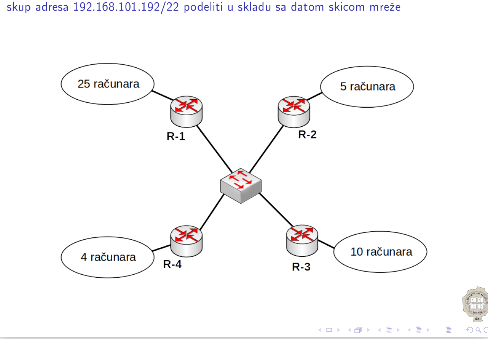
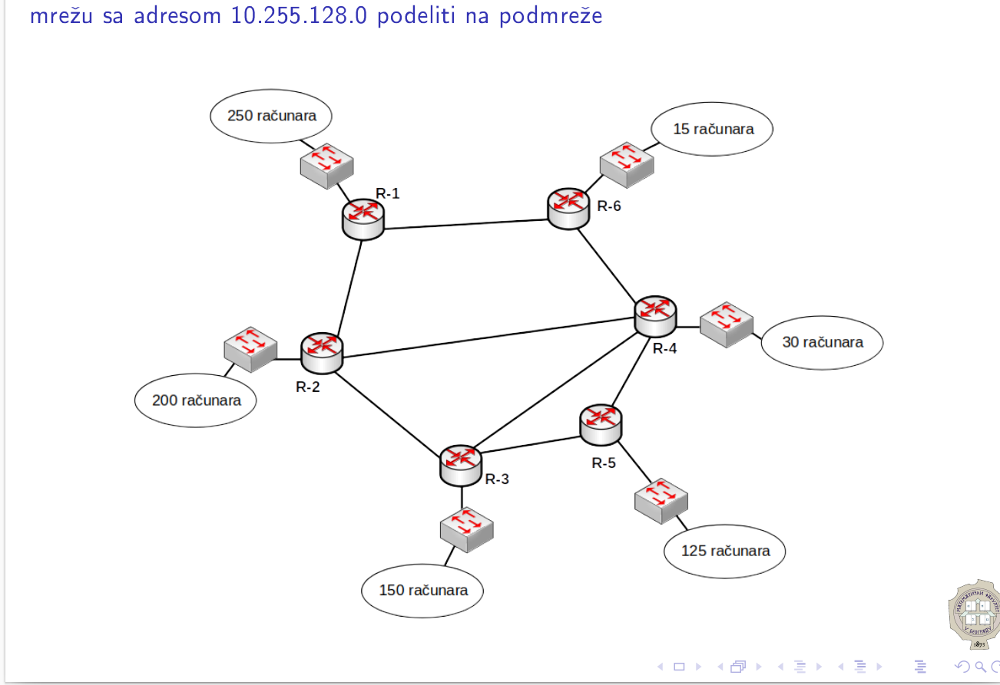

# Računarkse mreže (I), 5. vežbe

## Adresiranje

Prilikom izgradnje jedne računarske mreže, potrebno je svakom čvoru u toj mreži dodeliti adresu, koja služi za jedinstvenu identifikaciju tog čvora u mreži. Dodeljivanje adresa u okviru računarske mreže naziva se **adresiranje**. Oblik adresa koji se danas koristi u računarskim mrežama jesu **IP (Internet Protocol) adrese**.

Razvijanjem IP-a, razvijale su se i verzije IP adresa. Danas su u upotrebi dve verzije:

1. IPv4 adrese, veličine 4 bajta, tj. 32 bita.
2. IPv6 adrese, veličine 16 bajtova, tj. 128 bita.

### IPv4 adrese

- dužine 32 bit-a, tj. 4 byte-a
- ima ih $2^{32}=4\,\,294\,\,967\,\,296$ (broj mogućih adresa)
- zapis: _dotted quad_ - 4 broja iz opsega $[0,255]$ odvojena tačkom (jedan bajt predstavlja broj iz pomenutog opsega)
- primer: `147.95.15.25`, `192.168.0.7`

Ključno pitanje je kako se adrese dodeljuju čvorovima i kako se ovakav skup adresa deli na (manje) mreže. **IANA (Internet Assigned Numbers Authority)** je organizacija koja globalno administrira podelu IP adresa.

### Naivni pristup

IP adresu možemo podeliti na dva dela:

- prefiks, dužine $1\mathrm B$ koji identifikuje mrežu u kojoj se čvor sa tom IP adresom nalazi
- ostatak IP adrese, dužine $3\mathrm B$ koji identifikuje adresu tog čvora u datoj mreži

Ovakvim pristupom, podelili smo sve dostupne IP adrese u $256$ mreža, pri čemu je svaka mreža veličine $2^{24}=16\,\,777\,\,216$ (veličina mreže jeste ukupan broj adresa koji pripadaju toj mreži).

Ovakva podela je izuzetno nefleksibilna i nepraktična iz više razloga. Prvi je taj što smo dobili izuzetno mali broj mogućih mreža. Drugi razlog je taj što je svaka mreža ogromna, i u slučaju da nam je potrebna mreža veličine $2000$, morali bi da "zakupimo" mrežu veličine oko $16\,\,000\,\,000$.

### Classful adresiranje

Ovde takođe zadržavamo ideju podele IP adrese na dva dela:

- adresa mreže (levi deo adrese)
- adresa hosta u mreži (desni deo adrese)

U naivnom pristupu, fiksirali smo veličinu levog i desnog dela adrese. Ideja kod classful adresiranja jeste podela IP adresa u više klasa, pri čemu će veličina levog odnosno desnog dela adrese biti različita u zavisnosti od klase kojoj IP adresa pripada.

Podela IP adresa na klase u classful adresiranju:

| Klasa | Raspon (dotted quad)               | Raspon (binarno)                                                                            |
|-------|------------------------------------|---------------------------------------------------------------------------------------------|
| A     | `0.0.0.0` <br/>`127.255.255.255`   | `0\|000 0000 0000 0000 0000 0000 0000 0000`<br/>`0\|111 1111 1111 1111 1111 1111 1111 1111` |
| B     | `128.0.0.0` <br/>`191.255.255.255` | `10\|00 0000 0000 0000 0000 0000 0000 0000`<br/>`10\|11 1111 1111 1111 1111 1111 1111 1111` |
| C     | `192.0.0.0` <br/>`223.255.255.255` | `110\|0 0000 0000 0000 0000 0000 0000 0000`<br/>`110\|1 1111 1111 1111 1111 1111 1111 1111` |
| D     | `224.0.0.0` <br/>`239.255.255.255` | `1110\|0000 0000 0000 0000 0000 0000 0000`<br/>`1110\|1111 1111 1111 1111 1111 1111 1111`   |
| E     | `240.0.0.0` <br/>`255.255.255.255` | `1111\|0000 0000 0000 0000 0000 0000 0000`<br/>`1111\|1111 1111 1111 1111 1111 1111 1111`   |

Kako odrediti kojoj klasi pripada data IP adresa? Primetimo da svaka klasa ima prefiks kojim se karakterišu adrese te klase (deo adresa (u binarnom zapisu) odvojen uspravnom crtom). Prefiksi su: `0 (A), 10 (B), 110 (C), 1110 (D), 1111 (E)`. 

Kao što je i rečeno, podela adresa na levi i desni deo zavisi od toga kojoj klasi ta adresa pripada. Drugim rečima, svaku klasu delimo na različit broj mreža:

- Za adrese iz klase A, levi deo adrese je veličine $1\rm B$, dok je desni deo adrese veličine $3\rm B$. Ukupan broj mreža u klasi A je $2^7=128$ (prvi bit je fiksiran na `0`), dok je veličina svake mreže $2^{24}=16\,\,777\,\,216$
- Za adrese iz klase B,  levi deo adrese je veličine $2\rm B$, dok je desni deo adrese veličine $2\rm B$. Ukupan broj mreža u klasi B je $2^{14}=16\,\,384$ (prva dva bita su fiksirana na `10`), dok je veličina svake mreže $2^{16}=65\,\,536$
- Za adrese iz klase C,  levi deo adrese je veličine $3\rm B$, dok je desni deo adrese veličine $1\rm B$. Ukupan broj mreža u klasi C je $2^{21}=2\,\,097\,\,152$ (prva tri bita su fiksirana na `110`), dok je veličina svake mreže $2^{8}=256$

Adrese iz klasa D koriste se kao multicast adrese, dok se adrese iz klasa E koriste u eksperimentalne svrhe. Adrese iz klase A, B i C koriste se kao unicast adrese, odnosno adrese koje se dodeljuju korisnicima. 

Međutim, pri adresiranju postoje dodatne restrikcije:

- Prva adresa u mreži je rezervisana i ne može se dodeliti hostu. Ova adresa naziva se **adresa mreže**
- Poslednja adresa u mreži je rezervisana i ne može se dodeliti hostu. Ova adresa naziva se **broadcast adresa**. (služi za dostavljanje paketa svim čvorovima/hostovima u mreži)
- Mreže `0.0.0.0-0.255.255.255` i `127.0.0.0-127.255.255.255` (iz klase A) su rezervisane i koriste se (redom) za lokalnu mrežu odnosno loopback adrese
- Privatne adrese: određeni broj mreža iz klasa A, B i C rezervisan je za upotrebu u privatnim mrežama. To podrazumeva da se pomenute adrese neće propagirati na Internet, odnosno da te adrese ne predstavljaju adrese čvorova na Internetu. Takve adrese koriste se u lokalnim mrežama.
    - 1 mreža iz klase A: `10.0.0.0` - `10.255.255.255`
    - 16 mreža iz klase B: `172.16.0.0` - `172.16.255.255`, ... `172.31.0.0` - `172.31.255.255`
    - 256 mreža iz klase C: `192.168.0.0` - `192.168.0.255`, ... `192.168.255.0` - `192.168.255.255`

Iako su classful adresiranjem uvedene mreže različite veličine, pri čemu je broj mreža značajno povećan, i dalje se javlja problem nefleksibilnosti - šta ukoliko nam je potrebna mreža veličine $5000$?

### Classless adresiranje

Classless adresiranje omogućava da formiramo mreže veličine $2^n$ tj. možemo proizvoljan skup IP adresa sa zajedničkim levi delom adrese proizvoljne veličine posmatrati kao jednu mrežu. Međutim, javlja se pitanje - kako odrediti koji deo adrese je levi deo, a koji je desni deo - npr. kod classful adresiranja smo to određivali na osnovu klase kojoj adresa pripada.

Rešenje je dodavanje novog podatka uz samu vrednost IP adrese koja se naziva **maska**. Maska IP adrese sadrži informaciju o tome koji bitovi same adrese predstavljaju levi deo adrese, a koji bitovi predstavljaju desni deo adrese.

Posmatrajmo IP adresu `147.96.10.50/22`. Maska (zapisana u CIDR (Classless Inter-Domain Routing) formatu) je `/22` i daje informaciju da se levi deo adrese sastoji od prvih 22 bita. Alternativni zapis maske jeste binarni broj koji sadrži 22 jedinice i 10 nula (gledajući s leva na desno). Ovakav broj služi kao binarna maska (zbog čega je i ovaj podatak dobio naziv maska) koja služi za izdvajanje adrese mreže iz IP adrese koristeći bitovsku konjunkciju. Zapišimo adresu i masku u binarnom formatu:

```
1001 0011.0110 0000.0000 1010.0011 0010 - IP adresa
1111 1111.1111 1111.1111 1100.0000 0000 - maska

1001 0011.0110 0000.0000 10|00.0000 0000 - adresa mreže
1001 0011.0110 0000.0000 10|11.1111 1111 - broadcast adresa
```

Dakle, na ovaj način možemo dati skup IP adresa podeliti u mreže različitih veličina. Restrikcije koje smo definisali kod classful adresiranja prenose se i na classless adresiranje.

## Zadaci

### Classful adresiranje

**Zadatak 1.** Odrediti klase kojoj pripadaju naredne adrese i da li se mogu koristiti kao javne adrese?

- `10.11.12.13` - klasa A - ne, privatna adresa
- `172.30.40.50` - klasa B - ne, privatna adresa
- `172.40.50.60` - klasa B - može
- `127.255.255.255` - klasa A - ne, loopback adresa
- `128.0.0.0` - klasa B - ne, adresa mreže
- `9.256.128.64` - nije validna IP adresa (svi brojevi moraju biti u opsegu $[0,255]$)
- `128.255.255.255` - klasa B - ne, broadcast adresa
- `225.225.225.225` - klasa D - ne, multicast adresa
- `192.168.173.114` - klasa C - ne, privatna adresa
- `9.10.11.12` - klasa A - može
- `0.1.2.3` - klasa A - ne, lokalna mreža

### Classless adresiranje

**Zadatak 2**. Ispitati da li date IP adrese mogu biti adrese hostova.

- `147.91.64.0/22` - ne, adresa mreže\
    _Objašnjenje_: Prvih 22 bita određuju levi deo adrese. Da bi data adresa bila adresa hosta, mora biti različita od adrese mreže i od broadcast adrese. Ovo se ispituje određivanjem levog dela adrese, nakon čega je potrebno utvrditi da li se desni deo adrese sastoji od svih 0 (adresa mreže) ili svih 1 (broadcast adresa).
    ``` 
              levi deo         | desni deo    
    1001 0011.0101 1011.0100 00|00.0000 0000
    ```
    S obzirom da su svi bitovi u desnom delu adrese jednaki 0, ova adresa predstavlja adresu mreže.
- `162.29.94.0/7` - može\
    _Objašnjenje_: Maska iznosi 7 bitova. Tih 7 bitova se u potpunosti nalaze u prvom bajtu sa leve strane, tj u bajtu čija je vrednost `162`. S obzirom da preostala 3 bajta nisu svi jednaki `0` (binarno sve nule) ili svi jednaki `255` (binarno sve jedinice), jasno je da adresa neće biti adresa mreže niti broadcast adresa. Ovim smo uprostili rešavanje, jer IP adresu nismo raspisivali binarno
- `147.91.66.4/22` - može\
    _Objašnjenje_: S obzirom da je maska 22 bita, jasno nam je da se prva dva bajta nalaze u levom delu adrese, pa njih ne moramo raspisivati binarno. Potrebno je raspisati binarno treći bajt, s obzirom da 6 bita tog bajta se nalazi u levom delu adrese, a preostala 2 bita se nalaze u desnom delu adrese:
    ```
    66 - 0100 00|10
    ```
    Sada možemo zaključiti da desni deo adrese nije popunjen svim 0 ili svim 1, pa ovo može predstavljati adresu hosta u mreži.\
    _Napomena_: Ovde je takođe bilo moguće primetiti da se ova 22 bita u potpunosti nalaze u prva 3 bajta, pa kako poslednji bajt nije jednak `0` niti `255`, jasno je da data adresa nije niti adresa mreže niti broadcast adresa. Međutim, ideja je bila pokazati da je dovoljno raspisati binarno samo onaj bajt u kom se nalazi granica između levog i desnog dela adrese, što je u ovom slučaju bio treći bajt. Ovaj pristup značajno uprosti račun i potrebno je koristiti ga pri radu zadataka.
- `79.101.42.78/27` - može
    ```
    27 = 3 * 8 + 3 => raspisujemo poslednji bajt
    78 - 010|0 1110 => nisu svi bitovi u desnom delu jednaki 0 ili 1
  ```
- `79.101.42.64/27` - ne, adresa mreže
    ```
    27 = 3 * 8 + 3 => raspisujemo poslednji bajt
    64 - 010|0 0000 => svi bitovi u desnom delu su jednaki 0 - adresa mreže
  ```
- `1.0.0.15/28` - ne, broadcast adresa
    ```
    28 = 3 * 8 + 4 => raspisujemo poslednji bajt
    15 - 0000|1111 => svi bitovi u desnom delu su jednaki 1 - broadcast adresa
  ```
- `185.168.19.28/24` - može
    ```
    27 = 3 * 8 + 0 => raspisujemo poslednji bajt
    28 - |0001 1100 => nisu svi bitovi u desnom delu jednaki 0 ili 1
  ```
- `1.110.127.255/17` - ne, broadcast adresa
    ```
    17 = 2 * 8 + 1 => raspisujemo treći bajt
    127 - 0|111 1111 => kako je poslednji bajt jednak 255 (sve 1), 
                        to su svi bitovi u desnom delu jednaki 1 
                        - broadcast adresa 
  ```
- `1.110.127.255/16` - može
    ```
    16 = 2 * 8 => raspisujemo treći bajt
    127 - |0111 1111 => nisu svi bitovi u desnom delu jednaki 0 ili 1
  ```
- `77.46.128.128/25` - ne, adresa mreže
    ```
    25 = 3 * 8 + 1 => raspisujemo treći bajt
    128 - 1|000 0000 => svi bitovi u desnom delu su jednaki 0 - adresa mreže
  ```
- `79.111.255.255/12` - ne, broadcast adresa
    ```
    12 = 1 * 8 + 4 => raspisujemo drugi bajt
    111 - 0110|1111 => kako su poslednja dva bajt jednak 255a (sve 1), 
                       to su svi bitovi u desnom delu jednaki 1 
                       - broadcast adresa 
  ```
  
**Zadatak 3.** Za zadate mreže odrediti broj hostova, adresu mreže, broadcast adresu, adresu za prvi i poslednji uređaj u mreži.

- `172.30.40.50/16`
  ```
    Broj hostova: 2^16 - 2 
      Ukupno imamo 32 - 16 = 16 preostalih bitova nakon maske, pa imamo 2^16 mogućih adresa i znamo da su 
      2 zauzete za adresu mreže i broadcast adresu pa oduzimamo 2
    Adresa mreže: 172.30.0.0/16
      Znamo da u adresi mreže posle maske se nalaze svi bitovi sa vrednošću 0, pa su u ovom slučaju u poslednja 2 bajta sve nule.  
    Broadcast adresa: 172.30.255.255/16
      Slično, znamo da je za broadcast adresu svaki bit posle maske jednak 1, pa su u poslednja 2 bajta sve jedinice.
    Prvi uređaj: 172.30.0.1/16
      Adresa je za jedan veća od adrese mreže.
    Poslednji uređaj: 172.30.255.254/16
      Adresa je za jedan manja od broadcast adrese.
  ```
- `10.11.12.13/20`
  ```
    Broj hostova: 2^12-2
      Slično kao gore, samo što je broj bitova nakon maske 32-20 = 12 i 2 adrese za mrežu i broadcast.
    Adresa mreže: 10.11.0.0/20
      Ako raspišemo binarno 10.11.12.13/20 to će biti 0000 1010.0000 1011.0000 |1100.0000 1101 gde je maska naglašena sa |.
      Prema tome vidimo da nakon | treba da budu svi bitovi nula pa dobijamo gorenavedenu adresu
    Broadcast: 10.11.15.255/20
      Isti princip kao za adresu mreže s tim što posle maske postavljamo sve jedinice na bitove desno pa dobijamo:
      0000 1010.0000 1011.0000 |1111.1111 1111
    Prvi: 10.11.0.1/20
      Za jedan veće od adrese mreže.
    Poslednji: 10.11.15.254/20
      Za jedan manje od broadcast adrese.
  ```

- `10.11.12.130/26`
  ```
    Broj hostova: 2^6 - 2 = 62
      Posle maske je 32-26=6 bitova i 2 adrese za adresu mreže i broadcast.
    Adresa mreže: 10.11.12.128/26
      Vidimo da će maska se završiti u poslednjem bajtu.
      130 = 10|00 0010 i maska je do |. Nakon | treba da su sve 0 za adresu mreže, pa dobijamo 10|00 0000 što je zapravo 128.
    Broadcast: 10.11.12.191/26
      Slično, sad treba sve posle maske da je 1 što je: 10|11 1111 odnosno 191
    Prvi: 10.11.12.129/26
    Poslednji: 10.11.12.190/26
  ```
- `10.11.12.130/30`
  ```
    Hostova: 2^2-2 = 2
    Adresa mreže: 10.11.12.128/30
      130=1000 00|10, pa posle | idu sve nule.
    Broadcast: 10.11.12.131/30
      130=1000 00|10, pa posle maske idu svi bitovi 1
    Prvi: 10.11.12.129/30
    Poslednji: 10.11.12.130/30

    Napomena, s obzirom da samo dva hosta immao u ovoj mreži ovakva mreža se naziva point to point (uglavnom se samo 2 rutera nalaze u njoj)
  ```


**Zadatak 4.** Skup adresa `178.148.0.0/24` podeliti na naredne podmreže

  - A ima 120 računara
  - B ima 61 računara
  - C ima 25 računara
  - D ima 6 računara
  - 1 point-to-point segment

```
178.148.0.0/24

Sortiramo prvo sve mreže po veličini od najveće do najmanje. U ovom slučaju je to A,B,C,D, ptp (point-to-point)
Ako data mreža treba da sadrži određeni broj računara treba da vidimo koliko bitova je potrebno za tu mrežu.
Međutim, tu treba uračunati i adresu mreže i broadcast adresu. Takođe, treba imati u vidu i adresu rutera! 
Za ptp mrežu oba hosta će biti ruteri pa tu treba imati u vidu samo adresu mreže i broadcast adresu.

A: 120 + 3 <= 128 (7 bitova)
adresa mreže: 178.148.0.0/25    
broadcast: 178.148.0.127/25     

Gledamo koliko je potrebno bitova za A. Na broj računara (120) dodajemo 3 (adresa mreže, broadcast i ruter).
Vidimo da je potrebno 7 bitova, pa će maska biti 32-7=25. Poslednji bajt izgleda 0|000 0000 tj. 0 za adresu mreže i
0|111 1111 tj. 127 za broadcast adresu gde | predstavlja granicu za masku.

B: 61 + 3 <= 64 (6 bitova)
adresa mreže: 178.148.0.128/26  
broadcast: 178.148.0.191/26     

Ovde nam je potrebno 6 bitova pa će maska biti 26
Kako mreže ne smeju da imaju preklapanje, adresa mreže B mora da bude veća od broadcast adrese A. 
Odnosno, nalaziće se na sledećoj adresi posle broadcasta, 178.148.0.128/26, s tim što je maska za 1 veća.
Poslednji bajt u adresi mreže je onda 10|00 0000 gde je | kraj maske.
Broadcast će nam u poslednjem bajtu izgledati 10|11 1111 odnosno 191.

C: 25 + 3 <= 32 (5 bitova)
adresa mreže: 178.148.0.192/27
broadcast: 178.148.0.223/27

Slično, trebaće nam 5 bitova pa je maska dužine 27 i krećemo od sledeće adrese nakon broadcasta od B, odnosno 192 s maskom 27.
Poslednji bajt u adresi mreže je 110|0 0000 gde je | kraj maske.
Onda znamo da je broadcast adresa u poslednjem bajtu: 110|1 1111 odnosno 223.

D: 6 + 3 <= 16 (4 bita)
adresa mreže: 178.148.0.224/28
broadcast: 178.148.0.239/28

Opet ponavljamo postupak, adresa za mrežu je za 1 veća od prethodnog broadcasta i maska će u ovom slućaju biti 28, 
pa je adresa mreže u poslednjem bajtu 1110 |0000 odnosno 224
S druge strane broadcast adresa u poslednjem bajtu je 1110 |1111 odnosno 239

ptp: 2 + 2 <= 4 (2 bita)
adresa mreze: 178.148.0.240/30
broadcast: 178.148.0.243/30

2 rutera i adresa mreže i broadcast je ptp mreža. Ovde će maska biti 30, i adresa mreže u poslednjem bajtu za 1 veća od broadcast D,
tj. 1111 00|00 = 240 , dok je onda broadcast za ptp: 1111 00|11 = 243.

```

  **Zadatak 5.** Postavka zadatka je na sledećoj slici.
  
  

  ```
  172.21.244.0/22

  Slično kao u prethodnom zadatku, prvo sortiramo mreže po veličini.
  Imamo redosled 2A, 1A, 1C, 1B, ptp. 
  Tražimo koliko je bitova potrebno za svaku (dodajemo adersu mreže, brodcast adresu i adresu rutera za mreže koje nisu ptp)

  2A: 
  340 + 3 <= 512 (9 bitova)
  adresa mreže: 172.21.244.0/23
  broadcast: 172.21.245.255/23
  ruter: 172.21.244.1/23 (najmanja adresa u mreži)
  PC-8: 172.21.245.254/23 (najviša adresa u mreži)

  Maska će biti dužine 32-9=23.
  172.21.244.0 =172.21.1111 0100.0000 0000.
  Kad stavimo masku na 23. bit: 172.21.1111 010|0.0000 0000, pa je adresa mreže 172.21.244.0/23.
  S druge strane broadcast će biti: 172.21.1111 010|1.1111 1111, tj. 172.21.245.255/23


  1A: 
  180 + 3 <= 256 (8 bitova)
  adresa mreže: 172.21.246.0/24
  broadcast: 172.21.246.255/24
  ruter: 172.21.246.1/24 (najmanja adresa u mreži)
  PC-1: 172.21.246.2/24 (druga najmanja adresa u mreži)
  PC-2: 172.21.246.254/24 (najveća adresa u mreži)

  Gledamo sledeću adresu posle broadcasta u 2A i gledamo kako se maska menja, u ovom slučaju će biti dužine 24.
  Tada je adresa mreže 172.21.246.|0000 0000,
  a broadcast: 172.21.246.|1111 1111 i tako dobijamo gornji rezultat.

  1C: 
  100 + 3 <= 128 (7 bitova)
  adresa mreže: 172.21.247.0/25
  broadcast: 172.21.247.127/25
  ruter: 172.21.247.1/25 (najmanja adresa)
  PC-3: 172.21.247.2/25 (druga najmanja)
  PC-5: 172.21.247.126/25 (najveća adresa)

  Nakon prethodne broadcast adrese sledi: 172.21.247.0, ali ovde imamo dužinu maske 25,
  pa je adresa mreže 172.21.247.0|000 0000, 
  a broadcast 172.21.247.0|111 1111

  1B:
  5+3 <= 8 (3 bita)
  adresa mreže: 172.21.247.128/29
  broadcast: 172.21.247.135/29
  ruter: 172.21.247.129/29 (najmanja adresa)

  Sad je maska dužine 29, a sledeća adresa posle broadcasta 1C je 172.21.247.128 
  i onda je 172.21.247.1000 0|000 adresa mreže,
  a broadcast 172.21.247.1000 0|111

  ptp: 
  2 + 2 <= 4 (2 bita)
  adresa mreže: 172.21.247.136/30
  broadcast: 172.21.247.139/30
  R-Dep1: 172.21.247.137/30 (manja adresa)
  R-Dep2: 172.21.247.138/30 (veća adresa)

  Maska je dužine 32-2=30.
  Adresa mreže 172.21.247.1000 10|00,
  broadcast adresa: 172.21.247.1000 10|11
  ```
**Zadatak 6.** Ispravljeni tekst: Mrežu `192.168.100.0/22` podeliti u skladu sa datom skicom mreže, pri čemu dodeljivanje kreće od adrese `192.168.101.192`


```
Sve je isto kao i u prethodnom zadatku, s tim što nemamo ptp mrežu nego su nam 4 rutera na kraju u podmreži zajedničkoj.

192.168.101.192/22

R1: 
25 + 3 <= 32 (5 bitova)
adresa mreže: 192.168.101.192/27
broadcast: 192.168.101.223/27

192 = 110|0 0000 za adresu mreže
223 = 110|1 1111 za broadcast adresu

R3: 
10 + 3 <= 16 (4 bita)
adresa mreže: 192.168.101.224/28
broadcast: 192.168.101.239/28

224 = 1110 |0000
239 = 1110 |1111

R2: 
5 + 3 <= 8 (3 bita)
adresa mreže: 192.168.101.240/29
broadcast: 192.168.101.247/29

240 = 1111 0|000
237 = 1111 0|111

R4: 
4 + 3 <= 8 (3 bita)
adresa mreže: 192.168.101.248/29
broadcast: 192.168.101.255/29

248 = 1111 1|000
255 = 1111 1|111

R1234: 
4 + 2 <= 8 (3 bita)
adresa mreže: 192.168.102.0/29
broadcast: 192.168.102.7/29

4 rutera i adresa mreže i broadcast
Prelazimo 255, pa se povećava vrednost u prethodnom bajtu na 102.
U poslednjem bajtu imamo 0000 0|000 za vrednost adrese mreže i
0000 0|111 za broadcast

```

**Zadatak 7.** Koja je adresa najmanje mreže koja agregira sve dodeljene podmreže?


```
Princip rešavanja je isti kao do sada.
Jedino na šta treba obratiti pažnju jeste da imamo dosta ptp segmenata
i treba da budemo pažljivi da ne propustimo neki. 
Najbolje da nadjemo neki poredak po kom ćemo ići, npr. svi ptp koji imaju iz rutera 1, pa iz 2, itd.

Na kraju je potrebno samo naći najmanju masku, a to možemo uraditi ili tako što
saberemo ukupno bitova iz svake podmreže koji su potrebni za opisivanje pa na kraju oduzmemo taj broj od 32 
ili tako što svaku adresu mreže raspišemo binarno i nadjemo najveći zajednički deo s leva na desno.

10.255.128.0

M1: 
250 + 3 <= 256 (8 bitova)
adresa mreze: 10.255.128.0/24
broadcast adresa: 10.255.128.255/24

M2: 2
200 + 3 <= 256 (8 bitova)
adresa mreze: 10.255.129.0/24
broadcast adresa: 10.255.129.255/24

M3: 
150 + 3 <= 256 (8 bitova)
adresa mreže: 10.255.130.0/24
broadcast adresa: 10.255.130.255/24

M5: 1
25 + 3 <= 128 (7 bitova)
adresa mreže: 10.255.131.0/25
broadcast adresa: 10.255.131.127/25

M4: 
30 + 3 <= 64 (6 bitova)
adresa mreže: 10.255.131.128/26
broadcast adresa: 10.255.131.191/26

M6: 
15 + 3 <= 32 (5 bitova)
adresa mreže: 10.255.131.192/27
broadcast adresa: 10.255.131.223/27

M12: 
2 + 2 <= 4 (2 bita)
adresa mreže: 10.255.131.224/30
broadcast adresa: 10.255.131.227/30

M16: 
2 + 2 <= 4 (2 bita)
adresa mreže: 10.255.131.228/30
broadcast adresa: 10.255.131.231/30

M23: 
2 + 2 <= 4 (2 bita)
adresa mreže: 10.255.131.232/30
broadcast adresa: 10.255.131.235/30

M24: 
2 + 2 <= 4 (2 bita)
adresa mreže: 10.255.131.236/30
broadcast adresa: 10.255.131.239/30

M34: 
2 + 2 <= 4 (2 bita)
adresa mreže: 10.255.131.240/30
broadcast adresa: 10.255.131.243/30

M35: 
2 + 2 <= 4 (2 bita)
adresa mreže: 10.255.131.244/30
broadcast adresa: 10.255.131.247/30

M45: 
2 + 2 <= 4 (2 bita)
adresa mreže: 10.255.131.248/30
broadcast adresa: 10.255.131.251/30

M46: 
2 + 2 <= 4 (2 bita)
adresa mreže: 10.255.131.252/30
broadcast adresa: 10.255.131.255/30

Koja je adresa najmanje mreže koja agregira sve dodeljene podmreže?

Maska je najduzi zajednicki prefiks s leva na desno. Prva dva bajta su svima ista, od treceg se razlikuju. 
U trećem bajtu imamo 128,129,130,131. Bitovski to je:
1000 00|00
1000 00|01
1000 00|10
1000 00|11
Prvih 6 bitova za te brojeve su isti => Maska je onda 2*8 + 6 = 22 pa je adresa najmanje mreže 10.255.128.0/22
```
